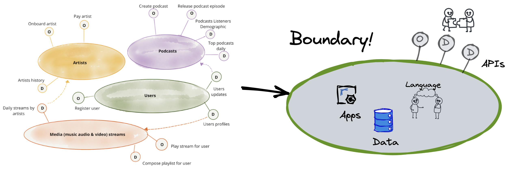
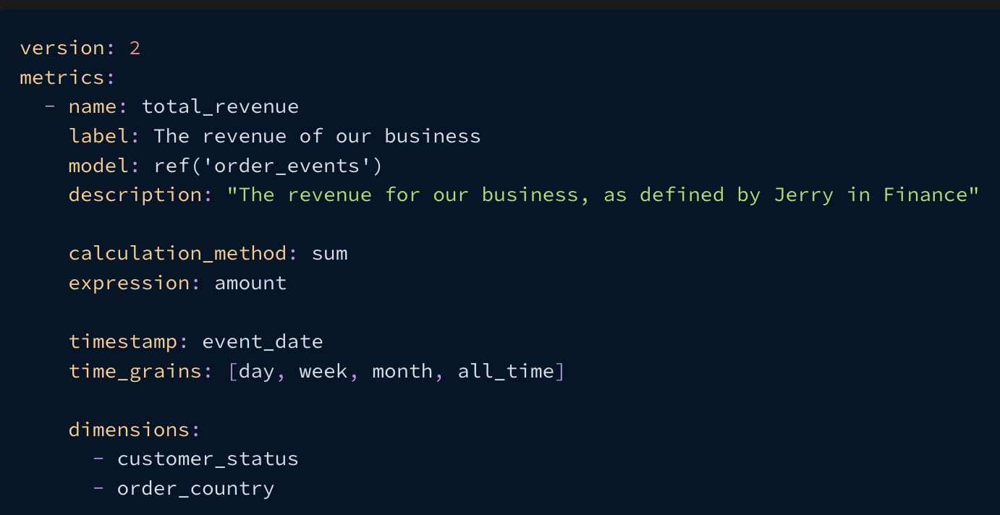

# Beyond Data Mesh

Data Mesh is a major advance over past architectures. It's the beginning, not the end of where we need to go. What do we need to do beyond the current Data Mesh architecture? As highlighted in the picture below[^original-data-mesh-material], Data Mesh is about 1) finding the right boundaries around apps and data and 2) putting stable access in place at those boundaries via different types of APIs. This article discusses the things we can do to find those boundaries and going beyond that to really enable the business. 

  [^original-data-mesh-material]: The left side of this picture is copied from: [Data Mesh Principles and Logical Architecture](https://martinfowler.com/articles/data-mesh-principles.html)

What I've seen of data mesh approaches is to focus on the data products that make up the boundary of the nodes in the mesh. This is starting too much at the end deliverable. The place to start is the boundaries. The secret to finding the boundaries is the ubiquitous language. The Domain Driven Design (DDD) community proposes various [ways to discover, document, and visualize the ubiquitous language](https://www.linkedin.com/advice/0/how-do-you-document-communicate-your-ubiquitous):

>The ubiquitous language is not just a set of terms or jargon, but a shared understanding of the domain and its problems. It reflects the domain model, which is the conceptual representation of the domain in code. The ubiquitous language and the domain model should evolve together, as the developers and the business experts learn more about the domain and refine their solutions. The ubiquitous language is important because it enables collaboration, alignment, and clarity among the different roles and perspectives involved in the software project.

We use the language to find the boundaries. The boundaries are at the points where the language of the domain’s data models and processing changes. This is where we want to put things like data products and APIs. Using the language also enables us to clearly understand what's going on behind those boundaries. 

## Domain Languages

This level of combining data product and DDD thinking is a good start. Really powerful capabilities are found by going beyond this. The DDD approach stops at things like, dictionaries, context maps, and living documentation is a dynamic form of documentation generated from source code and tests. We need to go beyond that and formalize the language.  That may sound cryptic or scary but it's not because there is a well established discipline and community for building Domain Specific Languages (DSLs) to help us and we don't need to go all the way to implementing a DSL to get a lot of the power we're after.[^DSL-community] 

[^DSL-community]: Great places to start with DSLs are this community: [Subject Matter First](https://subjectmatterfirst.org/) and the writtings of this master practitioner: [the further reading list after this article](https://www.linkedin.com/pulse/relationship-between-domain-driven-design-languages-markus-voelter/) or just google for anything written by Markus Voelter.

To start to get benefits from defining a language requires at least a minimal formalization. Formalizing the language means we work with the business users that operate in the domain to create a structured version of their ubiquitous language. This takes the form of a basic language structure and syntax.  The syntax is built on existing notations and conventions used in the domain, e.g., text, tables, symbols, and diagrams, not just lots of keywords and curly braces. It requires becoming very clear – formal! – about the concepts that go into the language. In fact, building the language, because of the need for formalization, helps you become clear about the concepts of the domain in the first place. The benefits of the approach happen right away because language definition acts as a catalyst for understanding the domain![^Markus-adapted]

[^Markus-adapted]: This content is adapted from articles written by [Markus Voelter](https://voelter.de/index.html). 

The previous paragraph is either sounding exciting or scary, depending on where you are on the idea of programming languages and the tech for building languages in general and DSLs in particular. Defining and potentially implementing a true DSL is the way to get to the ultimate in power and differentiation of a data mesh solution. Lets look at options for a first step short-cut to our desired result.

[Dbt](https://www.getdbt.com/) is one of the best technologies to get to a data mesh and move along the path to a DSL for the ubiquitous language approach proposed in this article. I'm not affiliated with the company behind dbt. I'm using it as a concrete example of the features needed to take this approach. That said, I am advocating for it's use because I really like it. 

For those not familiar with dbt, the important things about it for this discussion are:
- *Models* - Each model lives in a single file and contains logic that either transforms raw data into a dataset that is ready for analytics or, more often, is an intermediate step in such a transformation.
- *Sources* - A way to name and describe the data loaded into your warehouse by your Extract and Load tools.
- *Tests* - built from SQL queries that you can write to test the models.
- *Exposures* - A way to define and describe a downstream use of your project.
- *Macros* - Blocks of code written in Jinja, a templating language that you can reuse multiple times.

The following pictures show examples of some dbt configuration language files. The first is a dbt model which is nothing more than SQL.

The next picture shows the template for the additional configuration of a model.

Models are built by accessing the data exposed by other models or source. This is the core of a data API for a data mesh domain. You formally create your data products by *exposing* them. Dbt has some basic features to control access, e.g., Exposures, and they advancing those features rapidly. 

You could just use the out-of-the-box dbt features and implement a reasonable data mesh. All of it is written in text files and taken together it forms a domain language for your data transformation and access workflows. It's a low level and business domain independent language rather than a domain specific language. 

## Dbt Macros as the Beginning of a DSL

We move to being the move to a DSL through the use of dbt macros. Macros, written using dbt's Jinja features, are pieces of code that can be reused multiple times. Using macros we can build higher-level abstractions that are specific to the business domain. For example, rather than having analysts creating new data products rewrite the complex logic for combining data for some specific operation in the domain we can write it once as a macro and simplify and standardize that part of the operation. Programmers look at this as simply not repeating ourselves (DRY). It's more important to design the macros so they align with the ubiquitous language of the domain than to do it for technical reasons. There are significant limits to what we can do with macros and there is still a lot of dbt complexity and detail exposed. However, for the right audience domain specific macros can still be a major step forward. 

Using this approach the data mesh architecture looks like the following.

The exposed dbt models are serving the **D**ata API. That access can be via raw SQL or by creating new dbt models outside the domain boundary that use a data product. At the end of this article, I'll revisit the question of whether the Apps are inside the domain boundary. In the data mesh implementations I've seen, it's mostly been the apps as external data sources to a cloud-based data mesh. I feel we need to take a more whole-enterprise view of the bounded domains that makeup the data mesh so the apps should sometimes be inside. 

## semantic layer as a move by dbt to more DSL

The next step up the DSL ladder is already part of dbt: the [dbt Semantic Layer](https://www.getdbt.com/blog/dbt-semantic-layer-whats-next/). "The dbt Semantic Layer allows data teams to centrally define essential business metrics like revenue, customer, and churn in the modeling layer (your dbt project) for consistent self-service within downstream data tools like BI and metadata management solutions. The dbt Semantic Layer provides the flexibility to define metrics on top of your existing models and then query those metrics and models in your analysis tools of choice."[^dbt-semantic-layer]. This layer is a language for defining metrics. dbt talks about its value from the technical perspective. We're looking it as another part of our domain specific language. The business surely includes a lot in their ubiquitous language about the metrics, e.g., how are they named, how are they calculated, how do they evolve over time and where are they used. The following shows an example of a metric defined in the dbt language.

The following shows how the semantic layer fits into business use.

Examples of the kinds of metrics that can be expressed in the language:
- Expressions: (eg. transactions – cancellations)
- Ratios: (eg. revenue per customer)
- Cumulative Metrics (eg. weekly active users)
- Aggregation types (such as sum_boolean and percentile)

I see the value of a central definition of metrics in a semantic layer as transformative for a business. It will have dramatic effects on standardizing everything from basic BI reporting to the most advanced AI. The fact that the business can now see the definition 

As for all the rest of dbt, the metrics language is low level and generic rather than a business DSL. Once the metrics are defined, using them in combination with the domain specific dbt macros is a significant step forward.

  [^dbt-semantic-layer]: See: https://docs.getdbt.com/docs/use-dbt-semantic-layer/dbt-semantic-layer

## Ultimate End State of a DSL-Based Data-Mesh

There are limits to how well we can model the ubiquitous language of the business using dbt or similar generic tools. The power is substantially increased when we formalize as a domain specific language as described in the introduction. With the infrastructure of something like dbt we can have the DSL generate dbt configurations that do what the semantics of the DSL specify. The DSL isn't limited to just generating dbt. It would generate whatever is needed to perform the DSL statements. The following figure shows what this would look like.

The previous section covered how dbt would serve the Data APIs. We haven't talked about how to implement the regular API, e.g., http REST calls to retrieve data or do other processing. There is a deep problem with APIs and how clients use them especially when we are trying for strong domain boundaries. APIs typically do one, rather restricted thing, e.g., retrieve some data possibly filtered, store some data, etc, launch some processing. Ideally the APIs match the part of the language of the domain that we want to expose to clients. Current technology doesn't allow an API to do the kind of rich semantic operations that the ubiquitous language supports. The client needs to string together API calls to do something like select some data, transform it, calculate something, format it, and bring back the right subset of the results. I'm not talking about just SQL statements. I'm talking about doing interesting things in the ubiquitous language. DSLs offer a novel way to define APIs that solve this problem as indicated in the following picture.

The API accepts statements in the domain language, executes them and returns the results. This has benefits including:
- The client gets to fully express the full set of semantic actions they want to perform in the language instead of a series of separate API calls
- The language is part of the domain boundary because clients can't do anything that the language doesn't support. Making traditional API calls allows more extensive data extraction and manipulation without these limits.
- Only one API that accepts the language need be implemented[^language-based-api-limits]

  [^language-based-api-limits]: Yes there will potentially need to be different APIs for different aspects or sub-sets of the language. I'm exaggerating for impact. 

As discussed in earlier sections, there are multiple levels of language when using dbt. The out-of-the-box, the addition of macros, and the addition of the semantic layer. Each can be exposed a data API that builds as the implementation of the data mesh evolves. The full DSL-based API would use all of these lower level languages. 

## Everyone wants Self-Service

Few have credibly attained *self-service* data and processing and there is little agreement on how attain it: low-code/no-code, drag-and-drop UIs, AI/ML, Citizen Data Scientists, etc. I define self-service as the ability of the users to create executable solutions in or from the domain without the IT team doing a software development cycle. The solution can be as simple as getting access to existing data and using it to create new data or as elaborate as building a new application. With any of the dbt intermediate architectures described above in place self-service of things beyond simple are fully enabled. With the full DSL in place we attain elaborate self-service. For example, a data analyst could:
- Define new data models inside the domain 
- Use those domains to create a new data product to expose to other analysts
- Use the internal or data product models to define a new metric and expose that

If we don't attain these levels of self service we will never break out of the cycle of always being behind the business demands. Even more important, the right solutions will be built because the business users won't make mistakes on what to build they way it so frequently happens in a standard IT software dev cycle.

If we allow business users to build their own solutions, it needs to be done at level equivalent to an IT solution. This means: 
- Testing - before it can be used in production the analyst built solution needs to be tested. Dbt includes test automation and data quality checking as part of its language. Part of building a real DSL must include either including and integrating the dbt testing features or, ideally, having domain specific ways to test.
- Governance - before it can be moved to production impacts must be understood and managed, versioning must be supported, updates to metadata documentation must be done. Dbt includes a promotion process the supports moving new solution elements from dev to production, it supports versioning (and major extensions to versioning are coming soon), documentation is automatically produced.

A full DSL typcially includes an integrated editing and testing tool, e.g., an IDE style tool that is specific to the DSL. This level of DSL support dramatically enhances the self service. 

##  DSL used inside the domain vs. external/client DSL

The full DSL is more than just the data API for the mesh...

## This isn't just theory

We’ve wrapped it with a real DSL in several projects to supercharge self-service.
We’re now using tech that enables us to rapidly build comprehensive DSLs rapidly, e.g., to completely define a clinical protocol that can be translated into all the runtime and data management applications needed.

Examples of DSLs within a Bounded Domain:

dbt as basis of DSL for INTIENT

dbt for defining domain specific data vaults

DSL for Clario

## Bounded Domains is Data Mesh++

## Data Mesh is too narrow a name vs. Bounded Domains

It's not just about the data. This is where we revisit the question about apps in the domain vs. just data.
