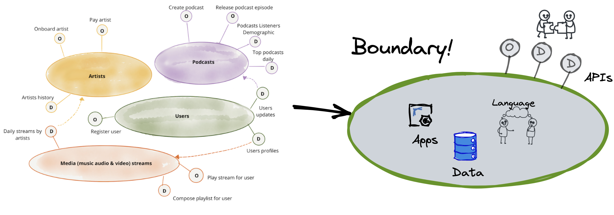
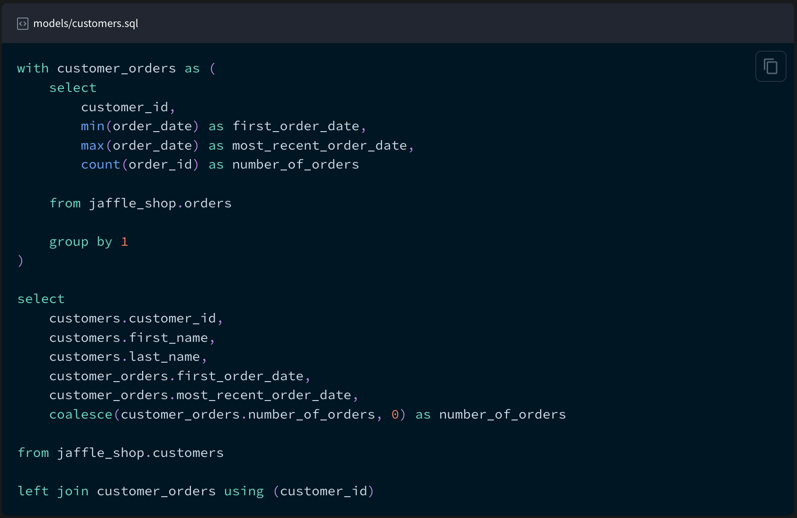
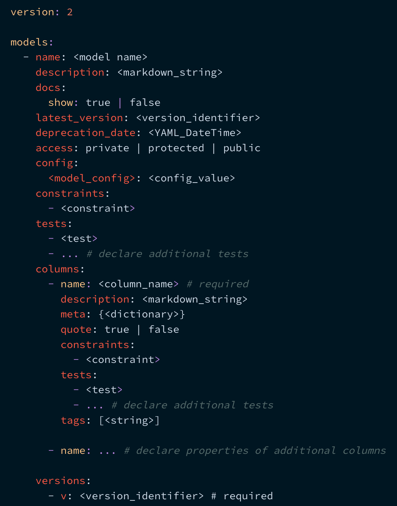
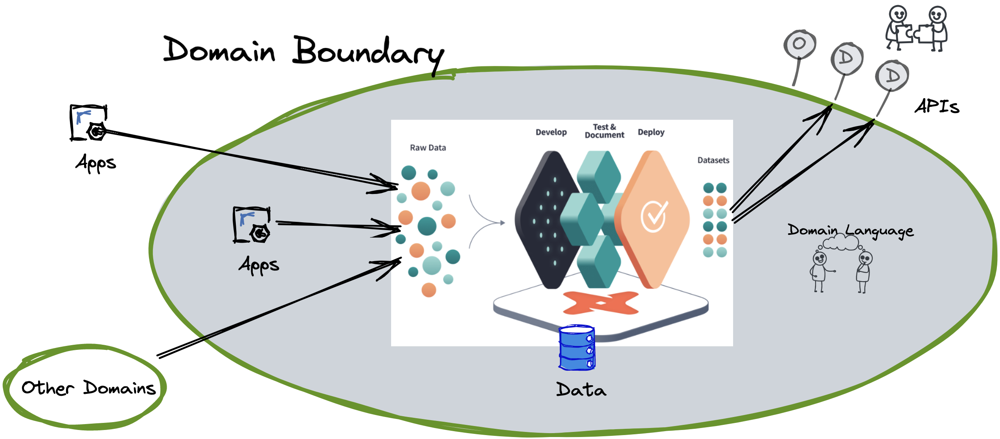
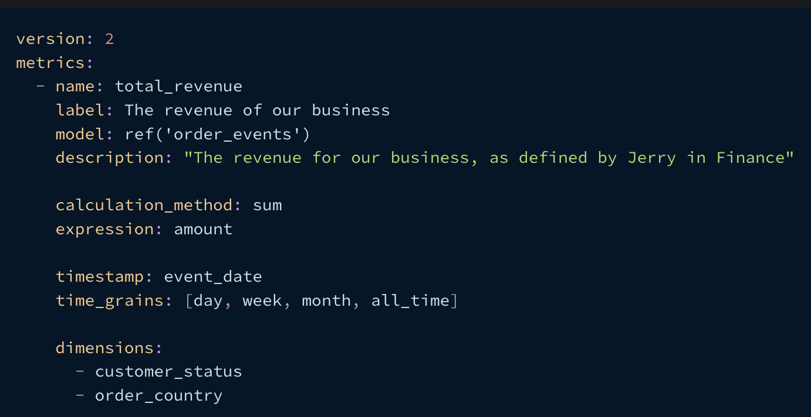
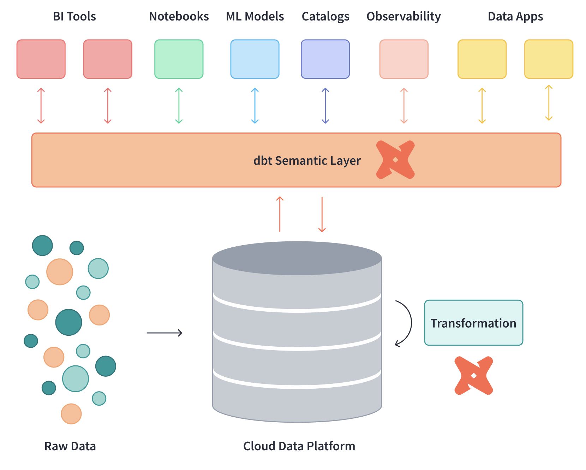
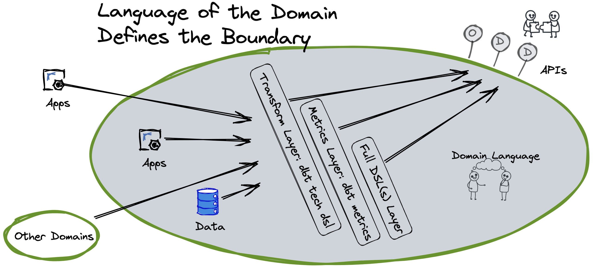
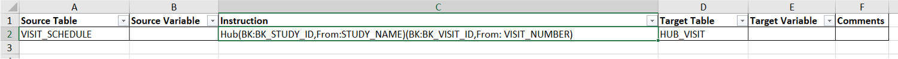
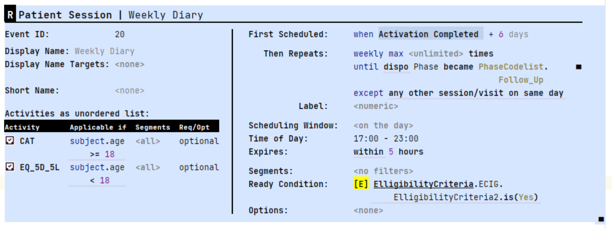
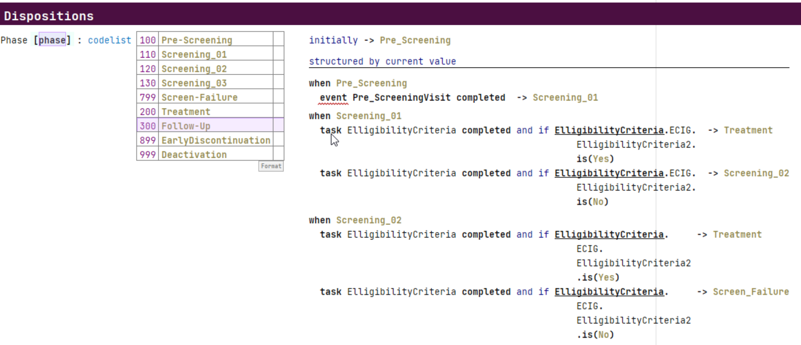

- [Subject Matter Expert Self-Service for the Data Mesh](#subject-matter-expert-self-service-for-the-data-mesh)
  - [The Domain Language Approach](#the-domain-language-approach)
  - [Domain Language Based Self-Service](#domain-language-based-self-service)
  - [Domain Languages](#domain-languages)
  - [Dbt Macros as the Start of the DSL](#dbt-macros-as-the-start-of-the-dsl)
  - [Adding Metrics to the Language](#adding-metrics-to-the-language)
  - [A Full DSL](#a-full-dsl)
    - [Data Vault Creation and Evolution Example](#data-vault-creation-and-evolution-example)
    - [Clinical Trial Data Mapping and Transformation Example](#clinical-trial-data-mapping-and-transformation-example)
    - [Full Clinical Trial Specification Example](#full-clinical-trial-specification-example)
  - [The Spectrum of Domain Languages](#the-spectrum-of-domain-languages)
  - [Summary and Closing Thoughts](#summary-and-closing-thoughts)
    - [DSLs and ChatGTP-LLMs](#dsls-and-chatgtp-llms)
- [Appendix: Additional Details](#appendix-additional-details)
  - [Data Mesh APIs](#data-mesh-apis)
  - [DSL Inside vs. Outside the Domain](#dsl-inside-vs-outside-the-domain)
  - [Additional SME Self-Service Features](#additional-sme-self-service-features)

By MIKE VOGEL [globallyunique@gmail.com](mailto:globallyunique@gmail.com). 

# Subject Matter Expert Self-Service for the Data Mesh

## The Domain Language Approach

For those engaged in building cloud data solutions that align with the distributed reality of the enterprise, Data Mesh[^data-mesh-intro] is a major advance over past architectures. However, it's the beginning, not the end of what we need to do to enable the self-service for users of the data mesh. 

Data mesh is referred to by it's originator as a "decentralized sociotechnical approach". This article discusses aspects of the *sociotechnical* work to 1) find the right boundaries for the domains that make up the nodes of the data mesh and 2) advance the way the business can access and operate on the domain. The picture below sets the context:

- The left side shows the core of the standard data mesh architecture of nodes and their APIs.[^original-article]
- The right side looks inside the boundary of a single data mesh node. We'll explore business enabling approaches inside and around the right side throughout the article.
 
  [^original-article]: This picture is is copied from the original article on data mesh: [Data Mesh Principles and Logical Architecture](https://martinfowler.com/articles/data-mesh-principles.html). 

  [^data-mesh-intro]: See [Data Mesh: Delivering Data-Driven Value at Scale](https://www.amazon.com/Data-Mesh-Delivering-Data-Driven-Value/dp/1492092398/ref=sr_1_1?crid=2WUIEMPCPFXWK&keywords=Data+Mesh%3A+Delivering+Data-Driven+Value+at+Scale&qid=1690809592&sprefix=data+mesh+delivering+data-driven+value+at+scale%2Caps%2C97&sr=8-1) or Starburst's [Description of a Data Mesh](https://www.starburst.io/learn/data-fundamentals/what-is-data-mesh/) and [Accelerating Your Cloud Migration Journey with a Data Mesh Architecture](accelerating-your-cloud-migration-journey-with-a-data-mesh-architecture/)

Finding the right boundaries for the nodes of the domain is critical to your data mesh architecture. What I've seen of approaches to data mesh projects is a focus on the data products to establish the boundaries. This is starting too data-centric and results in a jump to a subset of the things the business needs from a domain.  

The secret to finding the boundaries is the ubiquitous language of the domain. I'll make make the case for a deeply language-centric path to finding the data mesh architecture by exploring:
- How a language-based approach is the path to actual SME self-service
- The idea of the language of a domain as it's defining characteristic
- Use of a currently available implementation tool to start quickly on a version of the language for technical users
- Incrementally evolving the language by to make it more business user friendly
- Expanding into a full Subject Matter Expert (SME) Domain Specific Language

## Domain Language Based Self-Service

While using the ubiquitous language to identify data mesh nodes is a powerful approach, an even greater benefit is how it can enable self-service. I don't means self-service from infrastructure-as-a-service to enable delivery teams to create the data mesh. That kind of self-service in a data mesh platform is essential, but there are now many examples for how to do it. I mean self service to the data and processing of a domain by the business SMEs. Few have credibly attained this kind of *SME self-service* and there is little agreement on how attain it: low-code/no-code, drag-and-drop UIs, AI/ML, Citizen Data Scientists, etc. I define this kind of self-service as the ability of the SMEs to create *executable solutions* in or from the domain without the IT team doing a software development cycle. The *solution* can be as simple as getting access to existing data and using it to create new data, or as elaborate as building a new application. The practices proposed in this article are the path to this kind of SME self-service. 

The [Subject Matter First Manifesto](https://subjectmatterfirst.org/) quoted below, establishes the justification for this approach: 

> Subject matter experts own the expertise at the core of software. But too often this rich expertise is not captured in a structured way and gets lost when translating it for software developers.  With the rate of change increasing and product variability blooming, putting knowledge into software in this way is increasingly untenable. It causes delays, quality problems and frustration for everybody involved.
>
> We advocate for putting SMEs directly in control of “their” part of the software and letting developers focus on software engineering.

If we don't attain these levels of self service we will never break out of the cycle of always being behind the business demands. With a SME self-service architecture based on the domain language we eliminate all the mis-communication between the business and IT. The right *solutions* will be built because the SMEs won't make mistakes on what to build. These mistakes happen all to frequently in a standard IT software dev cycle. I won't repeat the detailed exploration of the justification of the approach, instead you should invest a few minutes to read the full [Subject Matter First Manifesto](https://subjectmatterfirst.org/).

## Domain Languages

The Domain Driven Design (DDD) community proposes various [ways to discover, document, and visualize the ubiquitous language](https://www.linkedin.com/advice/0/how-do-you-document-communicate-your-ubiquitous):

>The ubiquitous language is not just a set of terms or jargon, but a shared understanding of the domain and its problems. It reflects the domain model, which is the conceptual representation of the domain in code. The ubiquitous language and the domain model should evolve together, as the developers and the business experts learn more about the domain and refine their solutions. The ubiquitous language is important because it enables collaboration, alignment, and clarity among the different roles and perspectives involved in the software project.

The boundaries are at the points where the language of the domain’s data models and processing changes. We use the language and the boundary it defines to find the data products and APIs. Using the language also enables us to clearly understand what's going on behind those boundaries and to better enable that work.[^markus-on-DDD] 

[^markus-on-DDD]: For more about the intersection of DDD and the language of domains see [On the Relationship between Domain-Driven Design and Domain-Specific Languages](https://www.linkedin.com/pulse/relationship-between-domain-driven-design-languages-markus-voelter/)

Combining data mesh and DDD thinking is a good start. The DDD approach stops at things like, dictionaries, context maps, and living documentation as a dynamic form of documentation generated from source code and tests. Powerful capabilities are found by going beyond this and formalizing our understanding and definition of the ubiquitous language.  That may sound cryptic or scary but it's not because there is a well established discipline and community for building Domain Specific Languages (DSLs). The work of that community enables us to get to a full DSL.[^DSL-community] 

[^DSL-community]: Great places to start with DSLs are this community: [Subject Matter First](https://subjectmatterfirst.org/) and the writings of this master practitioner: [the further reading list after this article](https://www.linkedin.com/pulse/relationship-between-domain-driven-design-languages-markus-voelter/) or just google for anything written by Markus Voelter.

Formalizing the language means we work with the Subject Matter Experts (SMEs) of the domain to define the structure and syntax of the ubiquitous language. The syntax is built on existing notations and conventions used in the domain, e.g., text, tables, symbols, and diagrams, not just lots of keywords and curly braces. It requires becoming very clear – formal! – about the concepts that go into the language. In fact, building the language, because of the need for formalization, helps you become clear about the concepts of the domain in the first place. The benefits of the approach happen right away because language definition acts as a catalyst for understanding the domain![^Markus-adapted]

[^Markus-adapted]: This paragraph is taken from articles written by [Markus Voelter](https://voelter.de/index.html). 

Defining and potentially implementing a full DSL is the way to get to the ultimate in power and differentiation of a data mesh solution. Thankfully, we don't need to start doing full language engineering to get benefits of a language based approach. Lets look at options for a faster path to our desired result by starting with: [dbt](https://www.getdbt.com/).

Whether taking a language-centric approach or not, dbt is one of the best technologies to implement the core architecture of a data mesh. Even better, is how we can use it to smoothly move along the path to a full DSL for the ubiquitous language. I'm not affiliated with the company behind dbt. I'm using it as a concrete example of the features needed for the approach I propose. That said, I am also advocating for it's use because I really like it. 

For those not familiar with dbt, the following are the important parts a dbt solution is built from:
- *Models* - Each model lives in a single file and contains logic that either transforms raw data into a dataset that is ready for analytics or, more often, is an intermediate step in such a transformation. The essential thing in a model is some SQL.
- *Sources* - A way to name and describe the data loaded into your warehouse by your Extract and Load tools.
- *Tests* - built from SQL queries that you can write to test the models.
- *Exposures* - A way to define and describe a downstream use of your project.
- *Macros* - Blocks of code written in Jinja, a templating language, that enables you to write code you can then reuse multiple times.

The following pictures show examples of some dbt configuration language files. The first is a dbt model which, in this example, is nothing more than SQL placed in a file in the proper place in the dbt configuration structure.

The next picture shows the template for the additional configuration of a model. It's just more *configuration language* in a text file. 

Models are built by accessing the data exposed by other models or sources. A dbt solution built using this kind of configurations can be the core of a data API for a data mesh domain. You use SQL or additional dbt models to access the models defined as the data products of the domains in you data mesh. You formally create your data products by *exposing* them. Dbt has some basic features to control access, e.g., the Exposures described above, and they are advancing those features rapidly. 

All of the parts of a dbt solution are specified using the same kind of file-based configuration language. This language is the first iteration of automation of our domain language. You could just use these basic out-of-the-box dbt features and implement a reasonable data mesh. All of the configuration files taken together form a technical domain language for your data transformation and access. Dbt's models are a start at a language for data products. While we've taken a first step toward enabling SMEs, dbt's language is a low level and business domain independent language rather than the domain specific language we aspire to.

We need to start making an important distinction between a technical domain language and a domain language for SMEs. The critical difference in a language for SMEs is that it is as close as possible to the business language they use and technical details are suppressed. While SMEs can use a technical domain language, there are almost always a much smaller audience of such SMEs. We ultimately want to support the full community of SMEs by making a language that isn't generic or overly technical so we can  move the creation of the data products to the SMEs.[^dbt-vs-other-tools] 

 [^dbt-vs-other-tools]: Dbt is better than other products that attempt SME self-service because those tools and their drag-and-drop GUIs rarely allow enough customization to create a full DSL, e.g., creating a completely new domain specific front end while loosing none of the features of the tool. My experience is that generic drag-and-drop tools always require dropping down to a code level. This switch between GUI and code destroys understandability and productivity. A language approach assumes the DSL is the core of the solution and then selectively adds UI support for to make some complex language features easier to edit.

## Dbt Macros as the Start of the DSL

We move to being more of a DSL through the use of dbt macros. Macros, written using dbt's Jinja features, are pieces of code that can be reused multiple times. Using macros we can build higher-level abstractions that are specific to the business domain. We do this to avoid having SMEs creating new data products need to rewrite common complex logic. Instead, we can write it once as a macro and simplify and standardize that part of the logic. Programmers look at this as simply not repeating ourselves (DRY). More important than just avoiding repetition, we need to design the macros so they align with the ubiquitous language of the domain. There are significant limits to what we can do with macros and there is still a lot of dbt complexity and detail exposed. However, for the right audience, domain specific macros can still be a major step forward. 

 
Using this approach the architecture of a data mesh node (the right side of [the context picture](#beyond-data-mesh)) looks like the following.

The dbt configurations are executed as the logic of the domain to produce models. The exposed dbt models serve as the **D**ata API[^data-API]. That access to a data product can be via raw SQL or full APIs.   

  [^data-API]: In the data mesh pictures, APIs with a 'D' are Data APIs. Those with an 'O' are operational or other types of APIs.

## Adding Metrics to the Language 

The next step along the path to a SME DSL uses a relatively new feature of dbt: the [dbt Semantic Layer](https://www.getdbt.com/blog/dbt-semantic-layer-whats-next/). "The dbt Semantic Layer allows data teams to centrally define essential business metrics like revenue, customer, and churn in the modeling layer (your dbt project) for consistent self-service within downstream data tools like BI and metadata management solutions. The dbt Semantic Layer provides the flexibility to define metrics on top of your existing models and then query those metrics and models in your analysis tools of choice."[^dbt-semantic-layer]. This layer is a language for defining metrics. The business surely includes a lot in their ubiquitous language about the metrics, e.g., how are they named, how are they calculated, how do they evolve over time and where are they used. The following shows an example of a metric defined in the dbt language.

The following shows how the semantic layer fits into business use.

Examples of the kinds of metrics that can be expressed in the language:

- Expressions, e.g., `transactions – cancellations`
- Ratios, e.g., revenue per customer
- Cumulative Metrics, e.g., weekly active users
- Aggregation types, e.g., sum_boolean and percentile TODO: get better example of aggregation types

I see the value of a central definition of metrics in a semantic layer as transformative for a business. It will have dramatic effects on standardizing everything from basic BI reporting to the most advanced AI. The fact that the business can now see and configure the definition is a big part of this transformation. A single metric and it's dimensions can easily be a data product. Having metrics defined in the domain language further enables data product creation by SMEs.

Similar to the previously introduced parts of dbt, even the metrics language is low level and generic when compared to the how SMEs use their domain specific ubiquitous language to describe metrics. However, once the metrics are defined, using them in combination with the domain specific dbt macros is a significant step forward. 

  [^dbt-semantic-layer]: See: https://docs.getdbt.com/docs/use-dbt-semantic-layer/dbt-semantic-layer

## A Full DSL

As noted in the previous sections, there are limits to how well we can model the ubiquitous language of the business using dbt or similar generic tools. Our ability to really model the language becomes possible when we formalize[^formalize] our understanding of the language of the domain as a DSL[^yet-another-attempt]. With the infrastructure of dbt, or something similar, we can have the DSL generate dbt configurations that do what the semantics of the DSL specify. The DSL isn't limited to just generating dbt. It would generate whatever is needed to perform the DSL statements. The following figure introduces the what the architecture would look like when we introduce a full DSL.

The following are concrete examples of formalization of the language of the domain from my recent projects. The examples go from simple and more technical language structures to more complex and domain specific:

  [^formalize]: This article gets into the details of the formalization needed to know [When is something a (domain-specific) language?](https://www.linkedin.com/pulse/when-something-domain-specific-language-markus-voelter/)
  
  [^yet-another-attempt]: For more insight into what a DSLs and some additional examples see: [Yet another attempt at explaining Domain Specific Languages](https://www.linkedin.com/pulse/yet-another-attempt-explaining-domain-specific-markus-voelter/).

### Data Vault Creation and Evolution Example

A data vault[^data-vault] is a great data structure for use inside domains of the data mesh. Covering data vaults requires a separate article. For this example, just consider the vault to be a complex relational database structure that is used to organize the data into a kind of graph build from Hubs, Satellites, and Links. Creating and modifying data vaults was a common task on multiple of my projects. This example can be considered a *technical* DSL used by specialists responsible for loading the data. Initially, setting up the vaults was the domain of the modeling team, over time the SMEs started to propose the structures and talk in terms of the DSL when describing the data they wanted to access. 

We implemented a DSL for creation or change of a vault via a series of one line statements, e.g., the following is a simple examples that set up a hub and then does a data quality check to verify it worked:

In this example we didn't generate raw dbt configurations. Instead we used a the dbt vault extension [AutomateDV](https://automate-dv.com/)[^dbt-vault] to simplify the implementation. AutomateDV is another generic technical DSL layer on top of dbt. A full DSL was needed on this example project because even using the AutomateDV extensions was too technical. Using the extension took too much effort to use and test even for a dbt expert. With the full DSL, our modelers barely needed to understood dbt because the DSL matched their language for descrbing their data vault. 

### Clinical Trial Data Mapping and Transformation Example

There are SMEs who's job is to load and convert clinical trial[^clinical-trials] data from arbitrary input formats to an industry standard format. They need to do custom versions of this for every clinical trial and then deal with a series of requirements changes. We implemented a full DSL to express the mappings and transformations that generated dbt configurations. An example of the kinds of high-level domain specific instructions are those for processing data from laboratory tests. The instructions converts multiple laboratory values in a horizontal data layout, pivots it to be vertical as required by the standard and automatically deals with standard conversion tables and normal range checking. While you may not understand the details of this, describing how to do this is a central part of the ubiquitous language of clinical trail data. It typically requires detailed specifications that are then implemented as custom ETL or complex SQL. We implemented a single instruction, e.g., 

> `Lab Stack("WBC","WHITE BLOOD CELL COUNT","HEMATOLOGY","","BLOOD",LBHLAB,GEND,WBCRES,WBCU_)`

 [^clinical-trials]: Clinical trials are research studies that test a medical, surgical, or behavioral intervention in people. These trials are the primary way that researchers determine if a new form of treatment or prevention, such as a new drug, diet, or medical device (for example, a pacemaker), is safe and effective in people.

A clinical data conversion SME would read this like a sentence because the parameters are in an expected order of the domain when working with this type of data. This is a simple single instruction. We also implemented sequences of instructions that work as a unit, e.g., *Nesting* is the ability to use instructions within each other to provide seamless transformations while eliminating the need for temporary variables. We implemented a large set of interlocking statements like this that allowed a SME to perform their entire job. Each statement generated dbt configurations and additional code, and then our runtime system executed it. 

  [^data-vault]: See https://www.data-vault.co.uk/what-is-data-vault/ or google 'data vault' to see the massive amount of information available about it. 
  [^dbt-vault]: We used an earlier version of it called dbt-vault. It may have become easier to configure since then. What's important is the example of hiding technical details from the SMEs by wrapping it with a DSL. An important benefit of a tool evolution like this, discussed later in this article, is that the DSL isolates you from the tech changes, see:  write section on tech evolution. TODO: investigate whether it's more DSL in the new version.

### Full Clinical Trial Specification Example

The previous DSL was *relatively* simple because the scope was relatively small and relatively technical. It was substantially easier to implemented because it was mostly a layer on top of dbt. A tool like dbt is ideal for DSL creation because it is text based (a.k.a. configuration-as-code). The DSL then generates the dbt configuration files[^generate-more-than-dbt]. The focus can be on creating the language of the domain rather than that plus deep technical challenges related to making it possible to execute the DSL instructions. In this example, I'll briefly describe a DSL that doesn't use dbt but supports a much richer domain at a much more domain specific level. 

Clinical trails[^clinical-trials] always start with writing a scientific specification of the evaluation called a *Clinical Protocol*. We built a DSL that enables the SMEs to specify data collection, calculations, workflows, and reports to be run on clinical trial software systems.

The following shows an example of how a DSL[^clario-mps-talk] can look like a web data entry form but still contain complex domain specific instructions. For example there are multiple expressions in the fields that reference data in other parts of the DSL, e.g., "First Scheduled" is defined as "Activation Completion + 6 days". These expressions can be arbitrary complex and the user is guided so that they only create valid expressions while still just typing. 

The following shows a more complex DSL structure for defining when patients move through the phases of the clinical trial, e.g., they move when specific expressions about the eligibility criteria evaluate to true. The implementation of this is essentially a state transition diagram. While we have the capability to build a pure state transition DSL, we instead used the language of the SMEs in the domain. Notice that the word 'event' has a red squiggle under it. This is an example of a rich IDE that detects inconsistencies in the language as the user types and shows them as errors.

A DSL with this level of complexity requires more infrastructure than just a way to generate dbt files. In this case the runtime that needed to be configured is made up of many separate systems each different and each evolving what they support at different rates.  Luckily, there are powerful tools available for building DSLs of this complexity. The tool spectrum spans the language parser frameworks available in virtually every modern language, to things like the family of tools supporting the [Language Server Protocol](https://microsoft.github.io/language-server-protocol/), up to [MPS](https://www.jetbrains.com/mps/), the best tool for a comprehensive DSL.[^MPS] The DSL described in this section was implemented in MPS. See these additional case studies[^case-studies] for more examples.

  [^MPS]: Getting into DSL technology requires a separate article. Some great places to start are looking at [MPS](https://www.jetbrains.com/mps/) and [LIonWeb](https://github.com/lionweb-org/)

  [^generate-more-than-dbt]: It's never a simple as just generating dbt config files but that is the majority of what is generated. Other things like database DDL, blocks of shell scripts or python code are also generated to fill gaps between tools like dbt.

  [^clario-mps-talk]: These examples are taken from a presentation [by Clario at a DSL conference](https://www.youtube.com/watch?v=zag7hkaHWD0&list=PLQ176FUIyIUZ6e7lGYfyzYlnNkZiB2n9v&index=9).

 
  [^case-studies]: The following are case studies of DSLs built using the MPS technology stack. While not directly linked to building a data mesh, they show what can be done for the business within a domain(s): [Dutch Tax and Customs Administration](https://resources.jetbrains.com/storage/products/mps/docs/MPS_DTO_Case_Study.pdf?_ga=2.229567068.150420234.1691413922-272529924.1689613960&_gl=1*1bh6ywx*_ga*MjcyNTI5OTI0LjE2ODk2MTM5NjA.*_ga_9J976DJZ68*MTY5MTQxMzkyMS4xNC4xLjE2OTE0MTQyNDcuMjIuMC4w), [Weill Cornell Medicine](https://resources.jetbrains.com/storage/products/mps/docs/MPS_MetaR_Case_Study.pdf?_ga=2.36062816.150420234.1691413922-272529924.1689613960&_gl=1*c5u0gz*_ga*MjcyNTI5OTI0LjE2ODk2MTM5NjA.*_ga_9J976DJZ68*MTY5MTQxMzkyMS4xNC4xLjE2OTE0MTQyMzIuMzcuMC4w), [Embedded Systems](https://resources.jetbrains.com/storage/products/mps/docs/MPS_mbeddr_Case_Study.pdf?_ga=2.231493343.150420234.1691413922-272529924.1689613960&_gl=1*ift3j2*_ga*MjcyNTI5OTI0LjE2ODk2MTM5NjA.*_ga_9J976DJZ68*MTY5MTQxMzkyMS4xNC4xLjE2OTE0MTQzNTAuNjAuMC4w)

## The Spectrum of Domain Languages

How far to go on the spectrum of domain languages depends on the domain. A full DSL is appropriate when the work of specifying a solution meets the following criteria[^criteria]:

- Has complex rules, data, and processes and if the work of specification is dominated by business considerations rather than technical details 
- Is repeated frequently by different SMEs in the domain 

This level of work justifies the extra implementation effort for a full DSL. That work could be inside a single domain or across a closely related set of domains. When considering the boundary of the language don't get trapped into thinking that a domain is a simple flat structure. Domains are almost always a hierarchy containing sub-domains. Modeling the data mesh nodes and the languages they use needs to consider what level in the hierarchy of domains is the right place to establish the boundary to best serve the business needs. 

Examples of these rule justifying a full DSL:

- The above example of of specifying and automating the execution of the data collection and processing of a Clinical Trial justifies a full DSL because every trial is unique, the specification is dominated by the combination of how the science drives the technical details, and many trials are run in a year. 
- Specifying the tax rules for a country. The rules are complex, they change across each year so must be re-specified, and the specification is dominated by a mix of business and human complexity.[^tax-dsl] 
- Specifying the data products, analytics, metrics, and BI reports for a financial product. The specification changes for every customer in complex ways and lots of new customers are setup regularly. 

  [^tax-dsl]: A video about the Dutch Tax Administrations DSL https://www.youtube.com/watch?v=_-XMjfz3RcU. This article also covers it as one of the DSL examples: https://www.infoq.com/articles/why-dsl-collection-anecdotes/

A situation that might justify a full DSL even if the above criteria aren't met is if there is a lot of experimentation needed to find the right version of the configuration, e.g., as part of a rapid selling process the spec needs to be evolved and simulated. 

A domain language effort can start with the generic out-of-the-box domain language features of a tool like dbt and over time evolve to a full DSL. As the domain language is expanded it will have richer ways to define data products, do the transformations inside the domain, and access the data products.

How does buying a vendor solution fit into the DSL building decision? Vendor products need to be generic rather than domain specific so their target market size justifies their business. There are surely domain specific products, e.g., a product targeting clinical trials or financial investment products. Products always struggle with being domain specific enough to exactly match the organization and function of your business domains. Even the *configurable* or *programmable* products I've worked with over the years are rarely customizable enough to become truly domain specific without contorting them to the point where there is a major struggle to maintain them. Those that do offer configuration should be on the path to the ideal configuration via a DSL. When considering products which are on the configurability path, favor those that enable you to add your business specific specification via something like a DSL, e.g., products that are based on configuration-as-code like dbt. 

  [^criteria]: If you want a more precise discussion see: [Is a DSL suitable for you?](https://voelter.de/doyouneedone.html)

## Summary and Closing Thoughts 

As we model the language of the domains of our data mesh we can move along the following path:

- Use an out-of-the-box generic DSL style tool like dbt. 
- Expand to use more features of the tool, potentially in combination with other tools, e.g., use of the semantic layer language of dbt potentially in combination with another tool to do more advanced data quality checking, e.g, [Great-Expectations](https://greatexpectations.io/)
- Introduce a DSL. Frequently the first DSL tends to be more technical
- Expand the DSL to be more targeted at the SMEs of the domain. (Ideally you'd skip the previous step of building the more technical and start your DSL work here.)
- Expand to more comprehensive DSLs covering different domains.

This gets us to more than just the right domains for IT to implement, it breaks us out of the cycle of always being behind the business demands by putting SME self-service in place. A data mesh architecture that doesn't enable the business in this way is likely to have much less impact. 

*To the members of the data mesh community*: Hopefully you are already focused on the ubiquitous language and the ideas in this article either support what you are already doing or encourage you to consider a more language-centric approach.

*To the members of the DSL community*: We need to consider working in domains where the traditional criteria for investing in a comprehensive DSL may not be met. Instead we should investigate how our techniques can accelerate architectures like data mesh where there is a massive industry focus. 

### DSLs and ChatGTP-LLMs

We can't end without touching on the thing that has pushed data mesh out of the spotlight, AI via LLMs like ChatGTP. Although AI isn't *officially* part of building data mesh solutions, the DSL approach presented in this article flows smoothly into the ChatGTP excitment. The following articles discuss in detail how DSLs are an ideal way to use LLMs and ChatGTP to generate code that a business SME can actually understand! 

- [Are DSLs the catalyst for making AI-based programming practical?](https://www.linkedin.com/pulse/dsls-catalyst-making-ai-based-programming-practical-markus-voelter/?trk=pulse-article)
- [Demo of DSL Code Generated by ChatGTP](https://github.com/markusvoelter/chatGPTDemo/tree/main)
- [AI-based Prose Programming for Subject Matter Experts: Will this work?](https://urldefense.com/v3/__https://www.infoq.com/articles/ai-based-prose-programming-for-subject-matter-experts/__;!!OrxsNty6D4my!8acAGt4OFAhTPPf09uvycPpd9MvaWagorZx_tYEuYyRPLe4n3jIbVOMCGNdN-FwWz8PzHak7pZhWa9n78zU$)

# Appendix: Additional Details

## Data Mesh APIs

The previous sections focused on how dbt or an DSL that extends dbt would serve the Data APIs. We haven't talked about how to implement the regular API, e.g., http REST calls to retrieve data or do other processing.[^operational-api] These are the APIs labeled with 'O' in the following figure. It is my believe that there is a deep problem with the current state of APIs and how clients use them, especially when we are trying for strong domain boundaries. APIs typically do one, rather restricted thing, e.g., retrieve some data possibly filtered, store some data, launch some processing. Ideally the APIs match the part of the language of the domain that we want to expose to clients. Current technology doesn't allow an API to do the kind of rich semantic operations that the ubiquitous language supports. The client needs to string together API calls to do something like select some data, transform it, calculate something, format it, and bring back the right subset of the results. I'm not talking about just SQL statements. I'm talking about doing interesting things in the ubiquitous language. DSLs offer a novel way to define APIs that solve this problem.

[^operational-api]: The data mesh literature calls the APIs labeled as 'O' in the diagrams the 'operational' APIs. In this article I'm considering the 'D' APIs to be the database access to data-products via SQL and the http style access via the 'O' APIs. 

In a DSL-based architecture, the API accepts a group of statements in the domain language, executes them and returns the results. This has benefits including:
- The client gets to fully express the full set of semantic actions they want to perform in the language instead of a series of separate API calls
- The language is part of the domain boundary because clients can't do anything that the language doesn't support. Making traditional API calls allows more extensive data extraction and manipulation without these limits.
- Only one API that accepts the language need be implemented[^language-based-api-limits]

  [^language-based-api-limits]: Yes there will potentially need to be different APIs for different aspects or sub-sets of the language. I'm exaggerating for impact. 

As discussed in earlier sections, there are multiple levels of language when using dbt: the out-of-the-box, the addition of macros, and the addition of the semantic layer. Each can be directly exposed as a data API, e.g., expose an API that is just the dbt models serving as data products. The APIs can get richer as the implementation of the data mesh evolves, eventually having an API that accepted a full DSL. 

##  DSL Inside vs. Outside the Domain

It may be necessary to formalized two kinds of ubiquitous languages:
- the language used to do the work inside the domain boundary
- the language used by clients to interact with the domain

The language inside the domain can express operating on all the internal capabilities and data. External clients may be much more restricted in what they can access or do. When focused on the data mesh you are most likely to start with the client language, e.g., how to they interact with the data products. 

## Additional SME Self-Service Features

Recall my definition of SME self-service as the ability of the users to create *executable solutions* in or from the domain without the IT team doing a software development cycle. With any of the dbt intermediate architectures described above in place, self-service is enabled for technically capable SMEs. With a full DSL in place we attain powerful self-service for a much wider audience of SMEs. For example, a data analyst could:
- Define new data models inside the domain 
- Use those domains to create a new data product to expose to other analysts
- Use the internal or data product models to define a new metric and expose that

As we allow business users to build their own *solutions*, it needs to be done at level equivalent to an IT solution. This means real support for: 
- Testing - before it can be used in production, the SME's  solution needs to be tested.  
- Governance - before it can be moved to production impacts must be understood and managed, versioning must be supported, updates to metadata documentation must be done. 

Just using dbt can address these needs: 
- Dbt includes test automation and data quality checking as part of its language. 
- Dbt includes a promotion process the supports moving new solution elements from dev to production, it supports versioning (and major extensions to versioning are coming soon), documentation is automatically produced.

A full DSL typically includes integrated editing, testing, and deployment, e.g., an IDE style tool that is specific to the DSL. This level of DSL support dramatically enhances the self service. 

